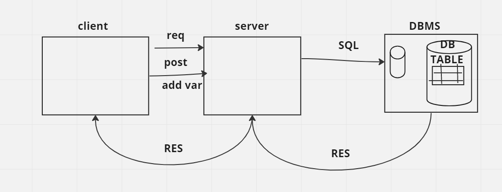

# Project Name : "Movies-Library" - Project Version :1.0.0

**Author Name**: Mustafa Mansour
---
  ---
  ## WRRC:
  
---

  ## Getting Started
<!-- What are the steps that a user must take in order to build this app on their own machine and get it running? -->

***first to first the user create the express and cors and require both nad declare the port then Create a constructor function to ensure your data follow the same format and create home route and get data from json file to see in the localHost, create favourite  route and error message for 500 and 404 Error.***

---
## Project Features
<!-- What are the features included in you app -->
show the list for movie and favourite page when the page is not defiend give error.

---
## lab12

in todays lab i learned how to send get requests to a 3rd party API and display data and to create Error Handler function.

  ## WRRC:
  

---

## lab13
***in todays lab i learned how to set up your database and read and save data to it***

---

  ## WRRC:

